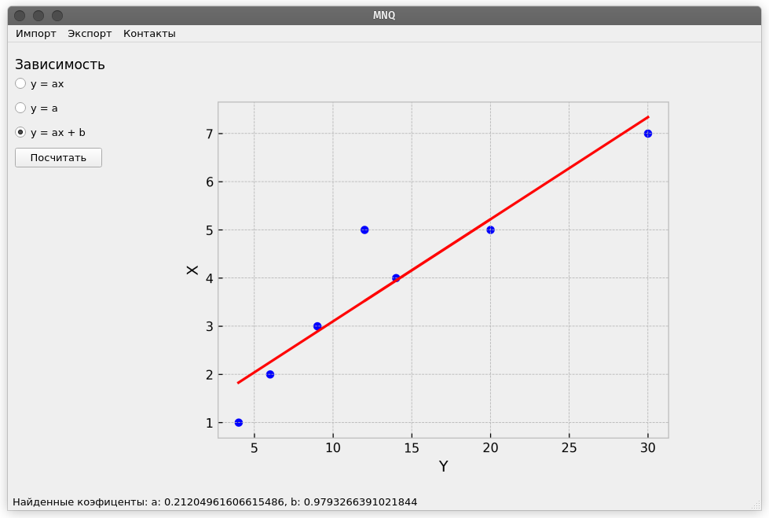
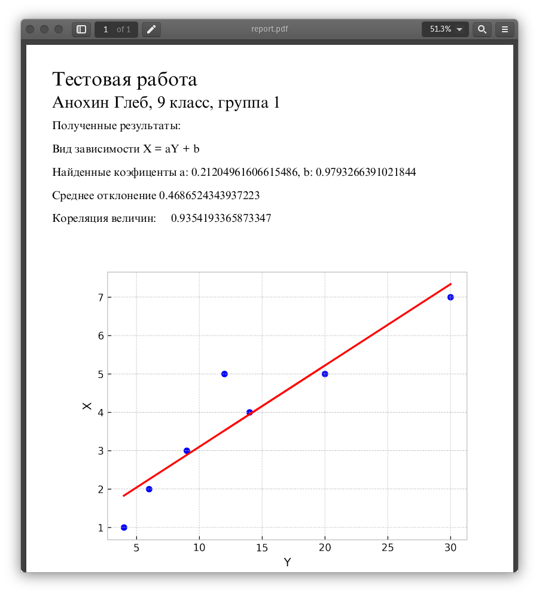

<!--_paginate: false-->

# MNQ
## Анохин Глеб

---

<h2 class="center-big-title">Что это?</h2>

---

## Работа с данными

Поддерживаемы форматы
- Excel
- CSV

---

## Прогнозирование

Доступен расчет зависимостей:
 
- y = ax + b
- y = ax
- y = a

---

## Получение результатов

---

<!--_paginate: false-->

## Спасибо за внимание!

